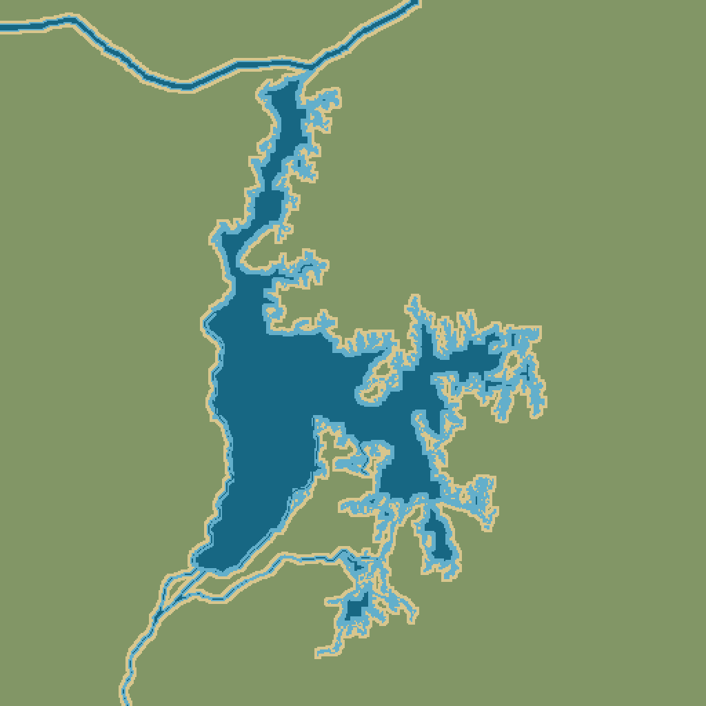
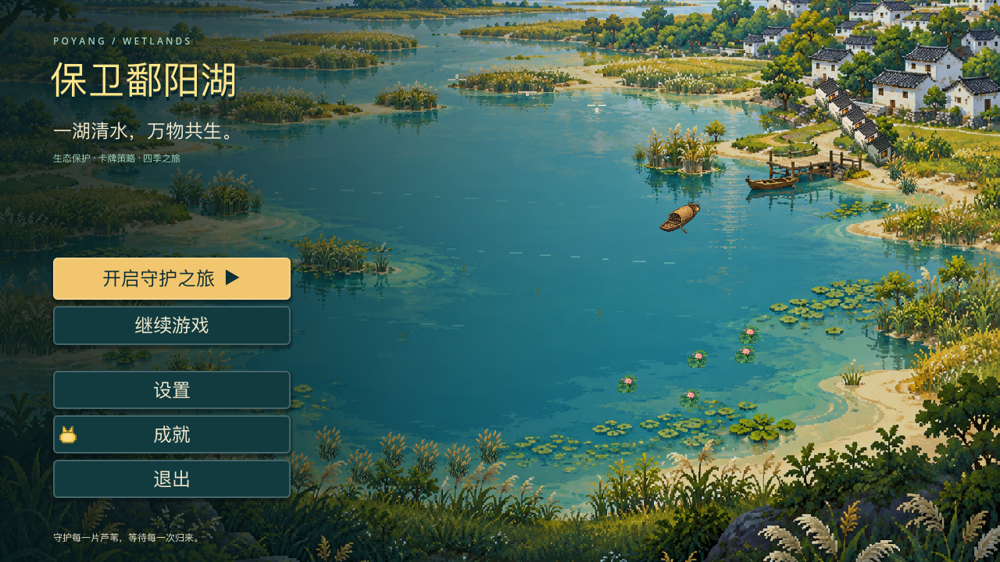
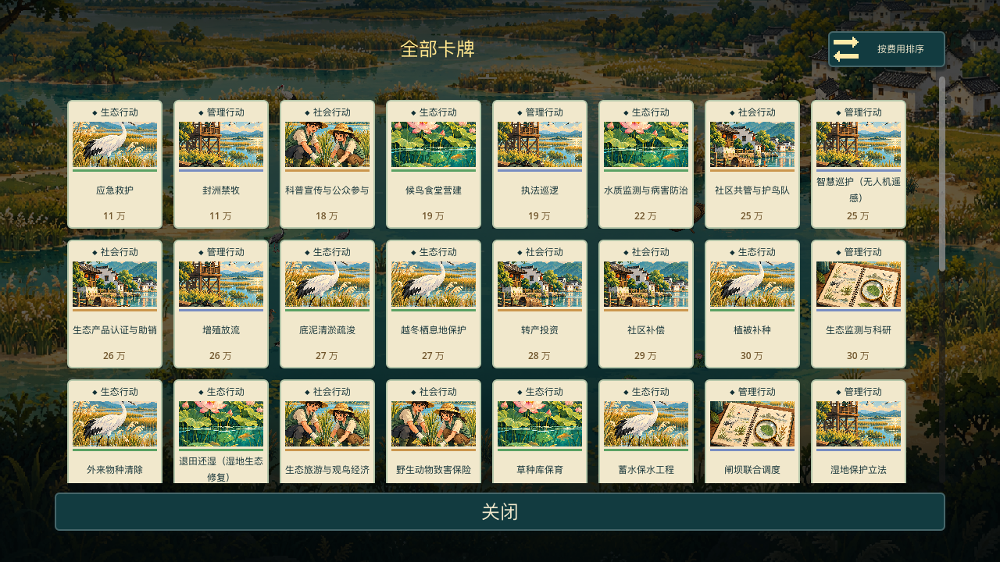

# 保卫鄱阳湖

面向中小学生的鄱阳湖生态保护卡牌策略游戏。选择生态、社会和管理行动，在四季变化中守护湖泊与候鸟。

本分支基于 `8b0807f` 重做视觉表现，保留原有数值、难度、卡牌效果和存档格式。

地图按公开鄱阳湖水域轮廓绘制，长江连接北端湖口，赣江主流及支汊从西南方向进入湖区。底图为 1024×1024 的正交俯视四种纯色地形；对局中默认放大显示湖区。候鸟、植物和村落独立绘制，随生态状态变化。

[地形来源、地理范围与导出说明](docs/TERRAIN_MAP.md)

## 运行

使用 Godot 4.7 stable 打开 `project.godot`，等待导入后按 F5。主场景为 `scenes/main.tscn`。

- 点击手牌选择行动，取消选择可收回预算。
- 左下切换基础、有效、深度投入；已选卡保留选中时的投入档位。
- 右侧查看生态指标、行动图鉴、紧急调度及刷新手牌。
- 点击「执行行动」结算回合，Esc 打开暂停菜单。

[改造说明、验证步骤与素材清单](docs/UI_REDESIGN.md) · [美术生成记录](docs/art-manifest.json)
